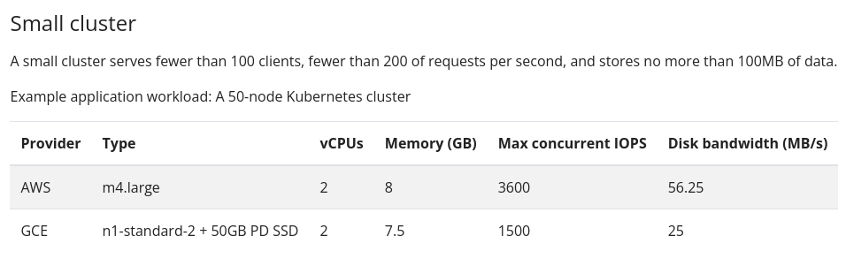

# PaaS-challenge

## Architecture

### Nodes

**Gateways: **2 gateway node with shared IP and HA with keepalived

**Ansible-master:** A control node to manage all nodes and execute the ansible playbooks.

**ETCD:** 3 nodes for etcd cluster with etcd v3.4.7

**K8S:** 3 master nodes + 1 worker node

### Diagram

### Gateways

The gateways are the communication way to the nodes. In this architecture, All nodes has private network. So there is no way accessing nodes unless the gateway. In other way, all nodes can access the internet via NAT protocol through the gateway node. So as we see, the gateway could be our point of failures. So we need to HA the gateway node and make it as high available as possible. For this purpose we could use the `keepalived`. 

The other role of gateways are:

- Loadbalancing requests between the kubernetes master nodes.
- Loadbalancing requests from the user to the cluster.

#### Implementation

### ETCD

#### ETCD Hardware requirement

​	Related to the etcd official doc about the [hardware requirement](https://etcd.io/docs/v3.3/op-guide/hardware/) for small cluster we need the following hardware requirement:

The cluster has been initialized with three nodes and TLS authentication. All certificates has been issued by `OpenSSL`.

#### Implementation

### ETCD disaster recovery

### K8S cluster

#### Implementation

### Challenges

#### Gateways

At first, I wanted to have a `virtual private IP` which can be handle by the openstack. And I wanted to assign a `floating IP` to the virtual ip port to have the internet via this port. But Because of the  [bug](https://bugzilla.redhat.com/show_bug.cgi?id=1707241) in the OVN  module of openstack my scenario has failed. So I had to assing two fixed public IP to each nodes and assing a `virtual public IP` to my gateway nodes to  handle the HA and config the keepalived.

##### What's wrong?

All the configuration was successfully done but at the last part the floating ip that has been assinged to the virtual ip port had no ping and connection.

#### ETCD

One of the most hard challenges I have was the etcd TLS authentication. I tried to issued the certs with `openSSL` but the certs had not worked. Related to the [github issue](https://github.com/etcd-io/etcd/issues/8603) these problems caused because of the lack of good etcd documentation.

After many research and tests I figured out the problems:

- **Key_usage:** I need to add the `keyEncipherment` key_usage to the server csr. Related to the serveruser website the keyEncipherment is:

  > Certificate may be used to encrypt a symmetric key which is then transferred to the target.
  >
  > Target decrypts key, subsequently using it to encrypt & decrypt data between the entities

- **Extended_key_usage:** This flag is additional restrictions need to add to the certs. For server cert should be `serverAuth` , client certs should be `clientAuth` and for peer certs should be both

- **Hostname is SAN:** There is a section in csr which you can specify the hostname and IPs. I just used the IP variable.

Thanks to [this](https://medium.com/nirman-tech-blog/setting-up-etcd-cluster-with-tls-authentication-enabled-49c44e4151bb) article which helps me a lot to troubleshoot.

### Refreneces

