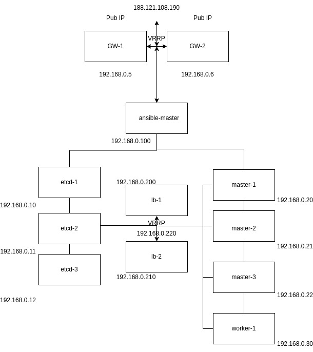
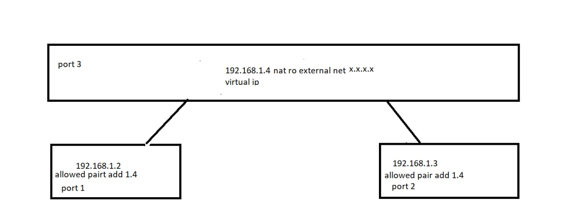

# PaaS-challenge

## Architecture

### Nodes

- **Gateways:** 2 gateway node with shared IP and HA with keepalived

- **Ansible-master:** A control node to manage all nodes and execute the ansible playbooks.

- **etcd:** 3 nodes for etcd cluster with etcd v3.4.7

- **K8S:** 3 master nodes + 1 worker node

### Diagram



**Note:** The etcd servers are connected to the masters api and there is no loadbalancing via the LBs.

## Gateways

The gateways are the communication way to the nodes. In this architecture, All nodes has private network. So there is no way accessing nodes unless the gateway. In other way, all nodes can access the internet via NAT protocol through the gateway node. So as we see, the gateway could be our point of failures. So we need to HA the gateway node and make it as high available as possible. For this purpose we could use the `keepalived`. 

The other role of gateways are:

- Loadbalancing requests between the kubernetes master nodes.
- Loadbalancing requests from the user to the cluster.

### Implementation

These gateways has two components:

- Keepalived: To ha the gateways I installed the keepalived and configure for ha the public IP.
- Haproxy: To loadbalance the client traffic to the ingress. (In our scenario we had not implement any ingress. We talk about the production.)

You can deploy the gateways via the [`lb`](./ansibles/roles/lb) roles in ansible folder.

## etcd

### etcd Hardware requirement

​	Related to the etcd official doc about the [hardware requirement](https://etcd.io/docs/v3.3/op-guide/hardware/) for small cluster we need the following hardware requirement:


The cluster has been initialized with three nodes and TLS authentication. All certificates has been issued by `OpenSSL`.

### Implementation

The etcd has been implemented via the systemd service and etcd binary files from offical repo.

This process has been automated with the TLS authentication and you can use it by the [`etcd-implementation`](./ansibles/roles/etcd-implementation)

### etcd disaster recovery

Related to the etcd official [documentation](https://etcd.io/docs/v3.5/op-guide/recovery/):

> etcd is designed to withstand machine failures.

So we can have some plans and scenarios to escape from any etcd disaster. For all the scenarios the most important thing is to have the etcd backup periodically. 

#### How to backup the etcd cluster?

select one of the etcd nodes and execute the following command:

```shell
etcdctl --endpoints https://192.168.0.10:2379 --cert=/etc/etcd/ssl/peer.crt  --key=/etc/etcd/ssl/peer.key  --cacert=/etc/etcd/ssl/ca.crt snapshot save /home/ubuntu/snapshot-22-07-14.db
```

**Note:** It's hardly recommended to save the etcd snapshot on another storage such as the object storage for keep it safe.

#### 1. Minor follower failure 

In this scenario the cluster is functional and can write and read the requests. So before any more failure happens and the quorum fails, we need to repair the failed node or replace it with new node. For this implementation follow the steps:

1. stop the etcd.service on the node:

   ```shell
   systemctl stop etcd.service
   ```

2. remove the node from the cluster:

   ```shell
   etcdctl  --endpoints=https://192.168.0.10:2379,https://192.168.0.11:2379,https://192.168.0.12:2379 --cert=/etc/etcd/ssl/peer.crt --key=/etc/etcd/ssl/peer.key --cacert=/etc/etcd/ssl/ca.crt member remove 6f03c26636586d04
   ```

3. add the new node (or the currently node) to the cluster:

   ```shell
   etcdctl  --endpoints=https://192.168.0.10:2379,https://192.168.0.11:2379,https://192.168.0.12:2379 --cert=/etc/etcd/ssl/peer.crt --key=/etc/etcd/ssl/peer.key --cacert=/etc/etcd/ssl/ca.crt member add etcd-3 --peer-urls=https://192.168.0.12:2380
   ```

4. If you are doing this process on a failure node which only lost the data dir you need only change the `/etc/etcd/etcd.conf.yaml` and set the `initial-cluster-state:exisiting`. But if you add replace node, after installing the etcd and etcdctl you need to add the following conf to `/etc/etcd/etcd.conf.yaml`:

   ```yaml
   data-dir: /var/lib/etcd/etcd-1.etcd
   name: etcd-1
   initial-advertise-peer-urls: https://192.168.0.10:2380
   listen-peer-urls: https://192.168.0.10:2380,https://127.0.0.1:2380
   advertise-client-urls: https://192.168.0.10:2379
   listen-client-urls: https://192.168.0.10:2379,https://127.0.0.1:2379
   initial-cluster-state: existing
   initial-cluster: etcd-1=https://192.168.0.10:2380,etcd-2=https://192.168.0.11:2380,etcd-3=https://192.168.0.12:2380
   client-transport-security:
     cert-file: /etc/etcd/ssl/server.crt
     key-file: /etc/etcd/ssl/server.key
     trusted-ca-file: /etc/etcd/ssl/ca.crt
   peer-transport-security:
     cert-file: /etc/etcd/ssl/peer.crt
     key-file: /etc/etcd/ssl/peer.key
     trusted-ca-file: /etc/etcd/ssl/ca.crt
   ```

5. start the etcd.service:

   ```shell
   systemctl start etcd.service
   ```

#### 2. Leader failure

In this scenario when the leader fails, the etcd cluster automatically start a new election to choose the new leader. This process takes the `election timeout` to replace the new leader.

According to the etcd official documentation:

> During the leader election the cluster cannot process any writes. Write requests sent during the election are queued for processing until a new leader is elected.

So after new leader elected, this scenario is similar to [Minor follower failure](####minor-follower-failure).

#### 3. Majority failure

When the majority of the nodes has failed, the cluster has collapsed. So there are two options:

1. Try to transform the scenario to the [Minor follower failure](####minor-follower-failure) by get some nodes back online!
2. Initialize the new-cluster on the healty node and join new members to it!

Let's see the second option:

1. First you need to choose one of the nodes to work on it.

2. Stop the `etcd.service` and delete the data-direcotyr on all nodes.

   ```shell
   systemctl stop etcd.service
   rm -rf /etc/etcd
   ```

3. Restore the snapshot.

   ```shell
    etcdctl  --endpoints https://192.168.0.10:2379  --cert=/etc/etcd/ssl/peer.crt  --key=/etc/etcd/ssl/peer.key  --cacert=/etc/etcd/ssl/ca.crt  --initial-cluster=etcd-1=https://192.168.0.10:2380,etcd-2=https://192.168.0.11:2380,etcd-3=https://192.168.0.12:2380  --initial-cluster-token=etcd-cluster-1  --initial-advertise-peer-urls=https://192.168.0.10:2380  --name=etcd-1  --skip-hash-check=true  --data-dir /var/lib/etcd snapshot restore /home/ubuntu/snapshot-22-07-14.db
   ```

4. edit the `/etc/etcd/etcd.conf.yaml` configuration file and add the `force-new-cluster` flag. Be sure that the `initial-cluster-state` set to new.

```yaml
name: etcd-1
initial-advertise-peer-urls: https://192.168.0.10:2380
listen-peer-urls: https://192.168.0.10:2380,https://127.0.0.1:2380
advertise-client-urls: https://192.168.0.10:2379
listen-client-urls: https://192.168.0.10:2379,https://127.0.0.1:2379
initial-cluster-state: new
force-new-cluster: true
initial-cluster: etcd-1=https://192.168.0.10:2380,etcd-2=https://192.168.0.11:2380,etcd-3=https://192.168.0.12:2380
client-transport-security:
  cert-file: /etc/etcd/ssl/server.crt
  key-file: /etc/etcd/ssl/server.key
  trusted-ca-file: /etc/etcd/ssl/ca.crt
peer-transport-security:
  cert-file: /etc/etcd/ssl/peer.crt
  key-file: /etc/etcd/ssl/peer.key
  trusted-ca-file: /etc/etcd/ssl/ca.crt
```

5. Start the etcd.service to initialize a new cluster:

```shell
systemctl start etcd.service
```

6. Check that if the etcd cluster has been initialized secussessfuly:

```shell
etcdctl  --endpoints=https://192.168.0.10:2379 --cert=/etc/etcd/ssl/peer.crt --key=/etc/etcd/ssl/peer.key --cacert=/etc/etcd/ssl/ca.crt endpoint health
```

7. Now it's time to add new members:

```shell
etcdctl  --endpoints=https://192.168.0.10:2379 --cert=/etc/etcd/ssl/peer.crt --key=/etc/etcd/ssl/peer.key --cacert=/etc/etcd/ssl/ca.crt member add etcd-2 --peer-urls=https://192.168.0.11:2380
```

The new member added to cluster. We need to start the etcd on the etcd-2 node but remember that we only have two initial_cluster nodes and if we start the etcd with another initial member we got the [`member count is unequal`](https://etcd.io/docs/v3.2/op-guide/runtime-configuration/#error-cases-when-adding-members)

8. Edit the `/etc/etcd/etcd.conf.yaml` file:

```yaml
data-dir: /var/lib/etcd
name: etcd-2
initial-advertise-peer-urls: https://192.168.0.11:2380
listen-peer-urls: https://192.168.0.11:2380,https://127.0.0.1:2380
advertise-client-urls: https://192.168.0.11:2379
listen-client-urls: https://192.168.0.11:2379,https://127.0.0.1:2379
initial-cluster-state: existing
initial-cluster: etcd-1=https://192.168.0.10:2380,etcd-2=https://192.168.0.11:2380
client-transport-security:
  cert-file: /etc/etcd/ssl/server.crt
  key-file: /etc/etcd/ssl/server.key
  trusted-ca-file: /etc/etcd/ssl/ca.crt
peer-transport-security:
  cert-file: /etc/etcd/ssl/peer.crt
  key-file: /etc/etcd/ssl/peer.key
  trusted-ca-file: /etc/etcd/ssl/ca.crt
```

It's time to start the service:

```shell
systemctl start etcd.service
```

9. Repeat this process for other members.

**Note:** If your nodes are damaged and you have to use new nodes, you have to install etcd and etcdctl before the above proccess.

#### Automation

Unfrotunately, This process hadn't been automated.

## K8S cluster

### Implementation

This cluster has 3 masters and 1 workers. For loadbalancing masters, I used the haproxy. The cluster has been initialized via `kubeadm`.

This process has been automated via the following roles:

- [kubernetes-prerequsites](./ansibles/roles/kubernetes-prerequsites/)
- [kubernetes-initialize](./ansibles/roles/kubernetes-initialize)
- [kubernetes-master-join](./ansibles/roles/master-join)
- [kubernetes-worker-join](./ansibles/roles/worker-join)

### Storage

My first choice to implement the storageClaas and the local-path provisioner was the [kubernetes local-static-provisioner](https://github.com/kubernetes-sigs/sig-storage-local-static-provisioner) which due to the errors I got from the persistentVolume in Mariadb-replication I changed the component to [rancher local-path-provisioner](https://github.com/rancher/local-path-provisioner).

#### Implementation

```shell
kubectl apply -f https://raw.githubusercontent.com/rancher/local-path-provisioner/v0.0.22/deploy/local-path-storage.yaml
```

And testing:

```shell
kubectl create -f https://raw.githubusercontent.com/rancher/local-path-provisioner/master/examples/pvc/pvc.yaml
kubectl create -f https://raw.githubusercontent.com/rancher/local-path-provisioner/master/examples/pod/pod.yaml
```

For specific configuration you can edit the Configmap in `local-path-storage` namespace ‍‍‍‍ ‍called `local-path-config` and change the config.json parameters:

```yaml
data:
  config.json: |-
    {
            "nodePathMap":[
            {
                    "node":"DEFAULT_PATH_FOR_NON_LISTED_NODES",
                    "paths":["/opt/local-path-provisioner"]
            },
            {
                    "node":"k8s-worker-1",
                    "paths":["/disks"]
            }
            ]
    }
```

### Helm

Installing helm chart can be done by the helm scripts:

```shell
curl -fsSL -o get_helm.sh https://raw.githubusercontent.com/helm/helm/main/scripts/get-helm-3
chmod 700 get_helm.sh
./get_helm.sh
```

### Mariadb-replication

### Upgrade the Cluster

## Challenges

### Gateways

At first, I wanted to have a `virtual private IP` which can be handle by the openstack. And I wanted to assign a `floating IP` to the virtual ip port to have the internet via this port. But Because of the  [bug](https://bugzilla.redhat.com/show_bug.cgi?id=1707241) in the OVN  module of openstack my scenario has failed. So I had to assing two fixed public IP to each nodes and assing a `virtual public IP` to my gateway nodes to  handle the HA and config the keepalived.



#### What's wrong?

All the configuration was successfully done but at the last part the floating ip that has been assinged to the virtual ip port had no ping and connection.

### etcd

One of the most hard challenges I have was the etcd TLS authentication. I tried to issued the certs with `openSSL` but the certs had not worked. Related to the [github issue](https://github.com/etcd-io/etcd/issues/8603) these problems caused because of the lack of good etcd documentation.

After many research and tests I figured out the problems:

- **Key_usage:** I need to add the `keyEncipherment` key_usage to the server csr. Related to the serveruser website the keyEncipherment is:

  > Certificate may be used to encrypt a symmetric key which is then transferred to the target.
  >
  > Target decrypts key, subsequently using it to encrypt & decrypt data between the entities

- **Extended_key_usage:** This flag is additional restrictions need to add to the certs. For server cert should be `serverAuth` , client certs should be `clientAuth` and for peer certs should be both

- **Hostname is SAN:** There is a section in csr which you can specify the hostname and IPs. I just used the IP variable.

Thanks to [this](https://medium.com/nirman-tech-blog/setting-up-etcd-cluster-with-tls-authentication-enabled-49c44e4151bb) article which helps me a lot to troubleshoot.

## Refreneces

